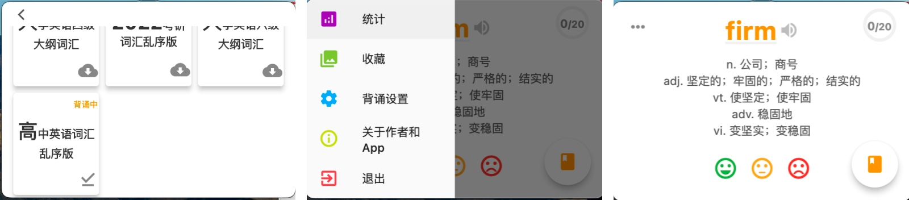

# 摸鱼单词
摸鱼但是以一款功能完善的开源背单词App, 支持多个平台.

## 核心功能
- 几十种免费单词本.
- 内置记忆曲线, 可自定义背诵方式.
- 提供单词统计和收藏功能.
- mac平台使用右上角小窗展示, 方便利用上班碎片时间背单词.

## 技术架构
`Django` `CSV` `Flutter` `Sqlite` `Https`
- 后端使用Python-Django框架提供图书下载和管理接口.
- 前端使用Flutter支持多平台, 并使用Sqlite作为本地数据库.

